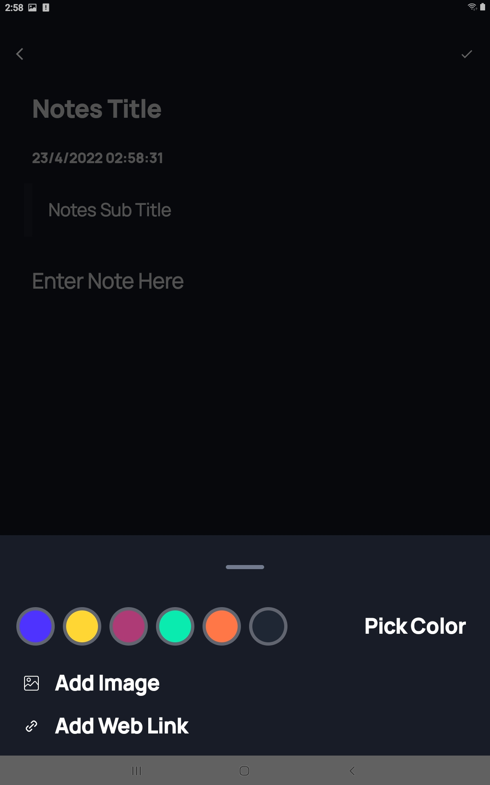
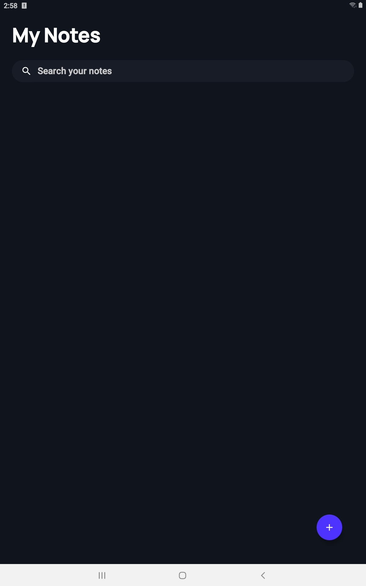
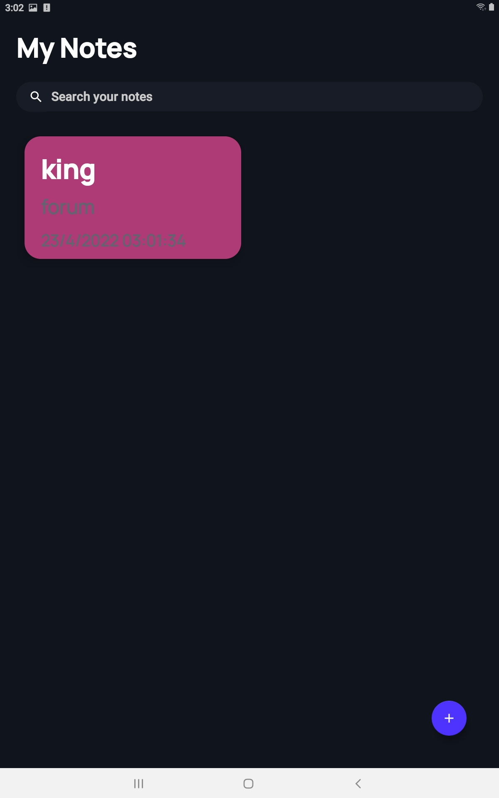

# 📒MyNotes

Note taking Android App using androidx libraries, MVVM with Google Architectural components Room, LiveData and ViewModel.
Written in Kotlin
 
#### This is a Beginner Friendly Repository made for Open Source Enthusiasts who can contribute to the App. 
#### To contribute in this project, you can update the existing applications.

## Features :

- **Plain Text Notes** - Take notes in an Secure & Great App.
- **Delete Notes** - Delete Notes using One Touch.
- **Web Url** - Add Website URL for storing Url.
- **Add Image** - Add Images in Notes to keep it Awasome.
- **Notes Colours** - Change/Add Differente colours of Notes.
- **Re-edit Notes** - Re-edit or Update Your Notes.

### Contributing
###### You can star ⭐ and fork 🍽️ this repository on GitHub by navigating at the top of this repository.

 ### Screenshots : 
 
  <table align="center">
  <tr>
     <td></td>
    <td></td>
    <td></td>
  </tr>
   
</table>  
